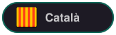

# Solar Explorer


<p>
  <a href="README.md"></a>
  
  <a href="README.ca.md"></a>
</p>

Interactive 3D Solar System built as a personal web project.

Solar Explorer combines a real-time 3D scene, astronomical data and a polished interface to create an immersive way to explore the Solar System from the browser.

[Live demo](https://solar.aleixaj.com) · [Repository](https://github.com/AleixAj/solar-system)

## Project approach

This is a personal project designed to grow over time. The goal is to build a complete interactive experience, not just a static demo: a navigable 3D scene, responsive UI, contextual information, language support and a maintainable codebase.

Main goals:

- Create an immersive browser experience with React, Three.js and React Three Fiber.
- Keep a clean, responsive interface that is easy to navigate on desktop and mobile.
- Structure the code with reusable components, typed data and purpose-built hooks.
- Handle the interaction between DOM UI, WebGL content, overlays and camera controls.
- Keep the project ready for future visual improvements without relying on heavy 3D models.

## Features

- Interactive 3D Solar System scene built with React Three Fiber.
- Selectable Sun and planets, with camera transitions and contextual panels.
- Guided/cinematic tour that automatically visits the main celestial bodies.
- Desktop side panel with navigation between bodies, active state and collapsible mode.
- Mobile drawer and floating buttons to open the planet list or the info panel on demand.
- Per-planet info panel with physical data, motion, known moons and fun facts.
- In-scene tooltips with quick facts.
- Time speed control from `0x` to `10x`, with `0.25x` as the initial value.
- Textured space background using an optimized image, subtle shooting comets in a CSS overlay and a mobile logo linking to the portfolio.
- Lightweight visual realism with textures, materials per planet type, subtle atmospheres, a soft solar halo and banded rings for Saturn.
- ES/EN language selector with persistent preference.
- "About this project" modal with technologies, general structure and links.
- Dark, responsive UI built with Tailwind CSS.
- Lazy-loaded panels and texture preloading for a smoother experience.

## Tech stack

- React 19
- TypeScript
- Vite
- Three.js
- React Three Fiber
- @react-three/drei
- Tailwind CSS

## Technical highlights

- UI architecture based on React components.
- Typed data modeling for planets, satellites and translatable content.
- 3D scene composition with meshes, materials, textures, atmospheres, space background, orbits and camera controls.
- State management with React Context and custom hooks.
- Responsive interaction patterns for desktop and mobile.
- DOM overlays on top of WebGL for lightweight effects such as shooting comets, independent of the 3D background.
- Attention to UI/UX: guided tour, modals, drawers, mobile floating buttons, hover states, active states, z-index, internal scrolling and accessibility labels.
- ES/EN internationalization without adding unnecessary dependencies.

## Frontend quality

- Guided tour with an animated camera and live tracking of the planet as it orbits.
- Mobile UX designed to keep the scene unobstructed: selecting a planet does not automatically open its info card, and the info/list shortcuts stay available at the top.
- UI micro-interactions with transitions, active states and `prefers-reduced-motion`.
- Lightweight, portfolio-oriented realism: Sun halo with a radial sprite, unobtrusive atmospheres and tuned materials without adding heavy models.
- Space background rendered as an inverted sphere inside the Canvas to add depth without relying on thousands of 3D points.
- Accessibility applied at key points: `Escape` to close layers, visible focus, `aria-label`, `aria-current`, dynamic language and a skip link.
- Attention to visual performance: adaptive DPR, fewer stars on mobile, decorative overlays disabled with `prefers-reduced-motion` and panels loaded on demand.
- Clear separation between the WebGL scene (`Scene`), UI (`UI`), state (`context`), hooks and data.
- English comments in the most relevant logic areas to make technical code review easier.

## Code structure

```txt
src/
├── components/
│   ├── Scene/       # Canvas, camera, planets, orbits, lights and stars
│   └── UI/          # Header, guided tour, panels, drawer, modal and controls
├── context/         # Language and simulation time intensity
├── data/            # Typed planet and satellite data
├── hooks/           # Camera animation, selection and responsive helpers
├── styles/          # Variables and global styles
└── utils/           # Scene, scaling and orbit utilities
```

## Local development

```bash
git clone https://github.com/AleixAj/solar-system.git
cd solar-system
pnpm install
pnpm dev
```

Open `http://localhost:5173`.

Useful commands:

```bash
pnpm lint
pnpm build
pnpm preview
```

## Roadmap

- Richer narrative for the guided tour with planet-specific texts.
- Fullscreen mode and screenshot capture.
- More information and interactions for moons.
- More cinematic camera presets.
- Further bundle splitting to optimize the Three.js scene.
- Additional optimized textures to improve planet realism without compromising smoothness.

## About the project

Made by Aleix Aj as a personal web project focused on 3D exploration, clean architecture and a polished user experience.